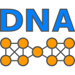

## Discourse Network Analyzer (DNA)

The Java software Discourse Network Analyzer (DNA) is a qualitative content analysis tool with network export facilities. You import text files and annotate statements that persons or organizations make, and the program will return network matrices of actors connected by shared concepts.

- Download the latest [release](https://github.com/leifeld/dna/releases) of the software.

- Annotate documents, such as newspaper articles or speeches, with statements of what actors say; then export network data.

- You can use the stand-alone software [visone](https://visone.ethz.ch/) (or any other network analysis software) for analyzing the resulting networks.

- The software comes with an R package called rDNA for remote controlling DNA and for further ways of analyzing the networks.

- The previous version of DNA and rDNA came with a detailed [manual](https://github.com/leifeld/dna/releases/download/v2.0-beta.25/dna-manual.pdf) of more than 100 pages. It is outdated, but perhaps still useful.

- See these [publications](https://www.philipleifeld.com/publications) to learn more. The introductory chapter in the Oxford Handbook of Political Networks is recommended.

- If you have questions or want to report bugs, please create an issue in the [issue tracker](https://github.com/leifeld/dna/issues).

[](https://github.com/leifeld/dna/actions/workflows/DNA%20build.yml)

## DNA 3.0: current development status

[DNA 3.0.7](https://github.com/leifeld/dna/releases) was released on 12 June 2022. It constitutes a major rewrite from the previous version DNA 2.0 beta 25. DNA 3 comes with many new features and improvements. The [release](https://github.com/leifeld/dna/releases) page for DNA 3.0.7 contains all the details.

Please use the old DNA 2.0 beta 25 for now if you require R functionality from the rDNA package for now. The new rDNA has rudimentary functionality and will be improved in future versions. It is possible to import DNA 2 data into DNA 3 at any point.

To install the new rDNA 3.0.7 directly from GitHub, try the following code in R:

``` r
# install.packages("remotes")
remotes::install_github("leifeld/dna/rDNA@*release",
                        INSTALL_opts = "--no-multiarch")
```

Note that the package relies on `rJava`, which needs to be installed first.

## Support the project

Please consider contributing to the project by telling other people about the software, citing our underlying [research](https://www.philipleifeld.com/publications) in your publications, reporting or fixing [issues](https://github.com/leifeld/issues), or starting pull requests.
